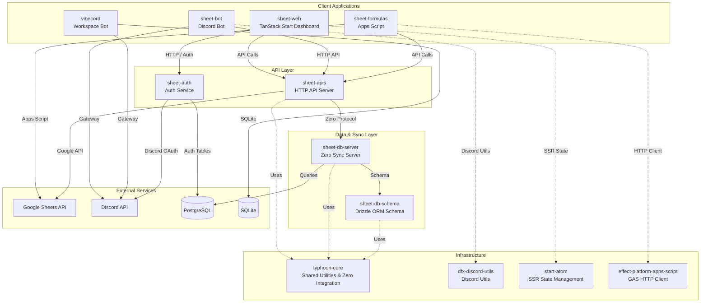
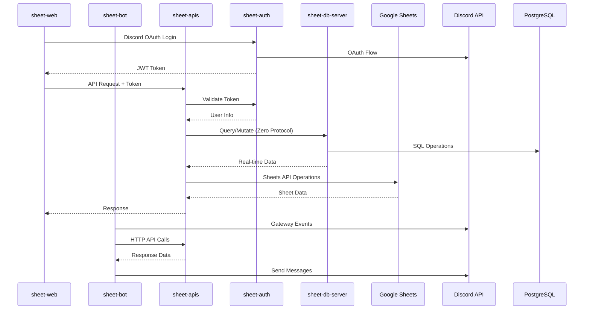
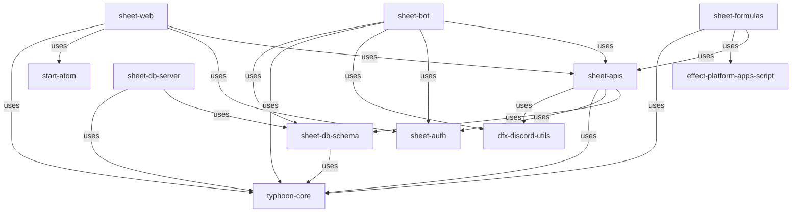

# TiaraStack Monorepo

A comprehensive monorepo containing tools for Google Sheets integration, Discord bot automation, and real-time collaborative applications.

## Overview

TiaraStack is a collection of interconnected services designed to provide seamless integration between Google Sheets, Discord, and web applications. The architecture follows a service-oriented design with clear separation of concerns.

## Architecture




## Package Structure

### Core Infrastructure


| Package                       | Description                                        | Tech Stack               |
| ----------------------------- | -------------------------------------------------- | ------------------------ |
| `typhoon-core`                | Shared utilities, Zero integration, schema helpers | Effect.ts, Rocicorp Zero |
| `bob`                         | Type-safe configuration builder                    | Standard Schema          |
| `dfx-discord-utils`           | Discord Effect utilities                           | dfx, unstorage           |
| `effect-platform-apps-script` | Effect HTTP client for Apps Script                 | Effect Platform          |
| `start-atom`                  | TanStack Start + Effect Atom integration           | Effect Atom              |


### Application Services


| Package           | Description                               | Tech Stack                            |
| ----------------- | ----------------------------------------- | ------------------------------------- |
| `sheet-apis`      | Main HTTP API server for sheet operations | Effect.ts, HttpApiBuilder, Playwright |
| `sheet-db-server` | Real-time sync database server            | Rocicorp Zero, Drizzle ORM            |
| `sheet-auth`      | Authentication service with Discord OAuth | Better Auth, Hono, Drizzle ORM        |
| `sheet-web`       | Web dashboard for guild management        | TanStack Start, React, shadcn/ui      |
| `sheet-bot`       | Discord bot for sheet integration         | dfx, Effect.ts, Handlebars            |
| `vibecord`        | Workspace/session management bot          | discord.js, SQLite, @opencode-ai/sdk  |


### Data & Integration


| Package           | Description                             | Tech Stack                    |
| ----------------- | --------------------------------------- | ----------------------------- |
| `sheet-db-schema` | PostgreSQL schema with Zero integration | Drizzle ORM, drizzle-zero     |
| `sheet-formulas`  | Google Apps Script formulas library     | Effect.ts, Google Apps Script |


## Service Interactions

### Request Flow




### Data Flow

1. **Web Application** (`sheet-web`)
  - Authenticates via `sheet-auth` using Discord OAuth
  - Makes API calls to `sheet-apis` for sheet operations
  - Uses `start-atom` for SSR-compatible state management
2. **Discord Bot** (`sheet-bot`)
  - Receives commands via Discord Gateway
  - Calls `sheet-apis` for backend operations
  - Uses `dfx-discord-utils` for caching and command building
  - Manages guild configurations and check-ins
3. **API Server** (`sheet-apis`)
  - Handles HTTP requests from web and bot clients
  - Integrates with Google Sheets via @googleapis/sheets and Playwright
  - Queries PostgreSQL via `sheet-db-server` using Zero protocol
  - Provides OpenTelemetry metrics and tracing
4. **Database Server** (`sheet-db-server`)
  - Provides real-time sync using Rocicorp Zero
  - Manages PostgreSQL schema via Drizzle ORM
  - Handles query and mutation requests
5. **VibeCord Bot** (`vibecord`)
  - Standalone Discord bot with SQLite database
  - Manages workspaces and sessions
  - Integrates with OpenCode Agent Client Protocol
  - Independent from sheet-services
6. **Apps Script** (`sheet-formulas`)
  - Runs within Google Sheets environment
  - Makes HTTP calls to `sheet-apis`
  - Uses `effect-platform-apps-script` for HTTP client

## Key Technologies

- **Effect.ts** (v3.19.8): Primary framework for type-safe, composable code
- **Rocicorp Zero**: Real-time sync protocol for database
- **TanStack Start**: Full-stack React framework with SSR
- **Drizzle ORM**: Type-safe SQL-like ORM for PostgreSQL
- **BetterAuth**: Authentication framework with Discord OAuth
- **dfx**: Discord Effect library for bot development
- **Nx**: Monorepo task runner and build system

## Development

### Prerequisites

- Node.js (LTS)
- pnpm
- PostgreSQL (for sheet services)
- Google Cloud project (for Sheets API)

### Setup

```bash
# Install dependencies
pnpm install

# Build all packages
pnpm -w build

# Run checks (lint, format, typecheck, test)
pnpm -w checks

# Apply formatting
pnpm -w format:apply
```

### Package Scripts

Each package supports standard scripts:

```bash
# Build
pnpm -w build

# Run all checks
pnpm -w checks

# Apply formatting
pnpm -w format:apply

# Package-specific scripts (run from package directory)
pnpm db:generate    # Generate Drizzle migrations
pnpm db:migrate     # Run migrations
pnpm db:push        # Push schema changes
pnpm db:studio      # Open Drizzle Studio (vibecord only)
```

## Project Structure

```
.
├── packages/
│   ├── typhoon-core/              # Shared utilities, Zero integration, schema helpers
│   │   ├── src/schema/            # Schema utilities
│   │   ├── src/utils/             # Utility functions
│   │   ├── src/error/             # Error handling
│   │   └── src/services/          # Core services
│   ├── bob/                       # Config builder utility
│   ├── dfx-discord-utils/         # Discord utilities
│   │   ├── src/discord/           # Discord-specific utils
│   │   ├── src/cache/             # Caching utilities
│   │   └── src/utils/             # Command builders & helpers
│   ├── effect-platform-apps-script/  # GAS HTTP client
│   ├── start-atom/                # TanStack Start + Effect Atom
│   ├── sheet-apis/                # HTTP API server
│   │   ├── src/handlers/          # API handlers
│   │   ├── src/services/          # Business logic
│   │   ├── src/middlewares/       # Auth middleware
│   │   └── src/schemas/           # Protocol schemas
│   ├── sheet-db-server/           # Zero sync server
│   │   ├── src/handlers/zero/     # Zero handlers
│   │   ├── src/services/          # DB service
│   │   └── src/config/            # Configuration
│   ├── sheet-db-schema/           # Database schemas
│   │   ├── src/schema.ts          # Drizzle tables
│   │   └── src/zero/              # Zero schema & mutators
│   │       ├── mutators/          # Zero mutations
│   │       └── queries/           # Zero queries
│   ├── sheet-auth/                # Authentication service
│   │   ├── src/plugins/           # Auth plugins
│   │   ├── src/auth-config.ts     # BetterAuth config
│   │   └── src/schema.ts          # Auth tables
│   ├── sheet-web/                 # Web dashboard
│   │   ├── src/routes/            # TanStack routes
│   │   ├── src/components/        # React components
│   │   ├── src/lib/               # Utilities & state
│   │   └── src/hooks/             # Custom hooks
│   ├── sheet-bot/                 # Discord bot
│   │   ├── src/bot/               # Bot implementation
│   │   ├── src/commands/          # Slash commands
│   │   ├── src/services/          # Business logic
│   │   ├── src/messageComponents/ # Message components
│   │   └── src/tasks/             # Background tasks
│   ├── sheet-formulas/            # Apps Script formulas
│   │   └── src/formulas.ts        # Formula implementations
│   └── vibecord/                  # VibeCord bot
│       ├── src/bot/               # Bot implementation
│       ├── src/commands/          # Slash commands
│       ├── src/services/          # Business logic
│       ├── src/db/                # SQLite schema
│       └── src/sdk/               # ACP integration
├── AGENTS.md                      # AI agent documentation
├── README.md                      # This file
└── package.json                   # Workspace root
```

## Dependencies Overview

### Direct Dependencies


